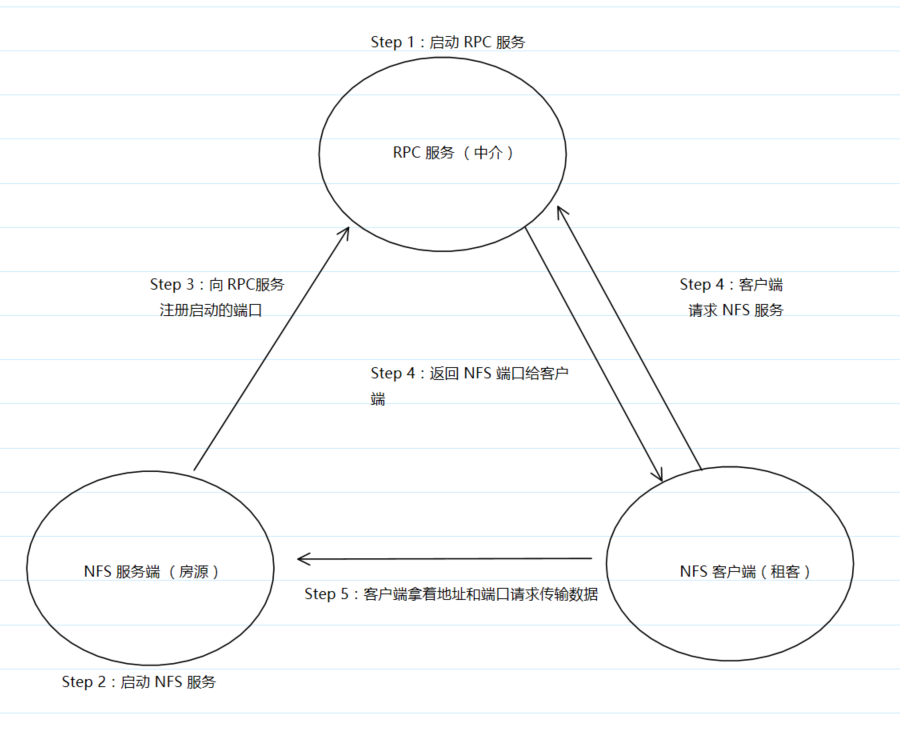
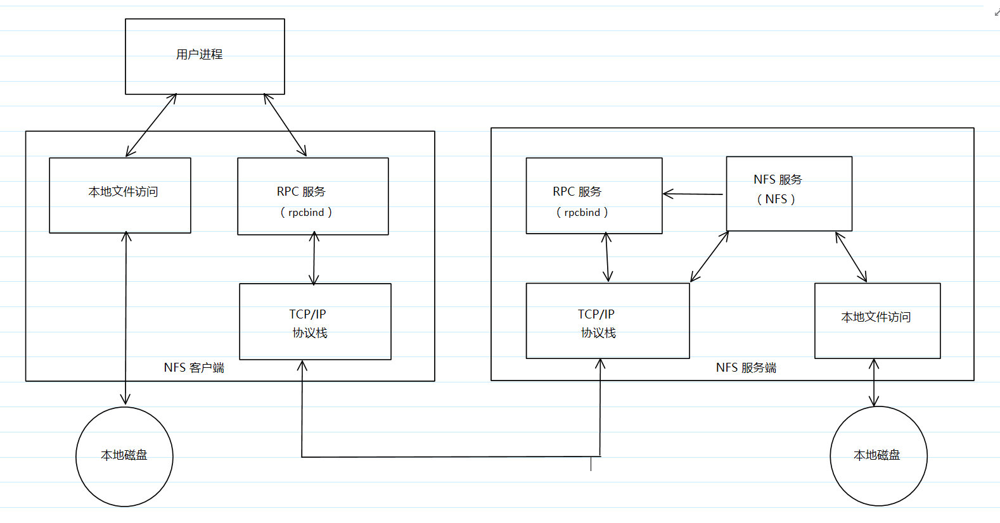

## 原理
### 什么是 NFS
	NFS 是 Network File System 的缩写，中文意思是网络文件系统。它的主要功能是通过网络(一般是局域网)让不同的主机系统之间可以共享文件或者目录。NFS 客户端(一般为应用服务器，例如 Web)可以通过挂载(mount)的方式将 NFS 服务器端共享的数据目录挂载到 NFS 客户端本地系统中(其实就是将共享目录挂载在某个挂载点下)。
### NFS 在企业中的应用场景
	在企业集群架构的工作场景中，NFS 网络文件系统一般被用来存储共享视频、图片、附件等静态资源文件，通常网站用户上传的文件都会放到 NFS 共享里

### RPC
	RPC 是 Remote Procedure Call 的缩写，中文意思是 远程过程调用

### NFS 与 RPC
	由于服务端开启 NFS 服务的端口不固定(即每次启动 NFS 服务的端口都不固定，也就是意外着，客户端 NFS 不能找到正确的服务端 NFS 服务的端口，必然无法完成正常的通信)，为了解决 NFS 服务端 和 NFS 客户端的通信障碍，这个时候就要通过调用 RPC 服务来解决这个问题。NFS 的 RPC 服务最主要的功能就是记录每个 NFS 功能所对应的端口号，并且在 NFS 客户端请求时将端口和对应的功能等信息传递给 NFS 客户端，从而保证了客户端可以找到 NFS 服务端的端口并完成连接，达到传输交互数据的目的。那么问题来了，RPC 又是如何知道 NFS 每个端口对应的每个功能呢？其实是这样的：当 NFS 服务端启动 NFS 服务的时候会主动想 RPC 服务注册取用的相关端口及功能信息。如此一来，RPC 便知道每个 NFS 端口对应的功能了，如何 RPC 服务使用固定的111端口来监听 NFS 客户端提交请求，并将正确的 NFS服务端端口信息回复给请求的 NFS 客户端。所以这就是为什么 NFS 服务端得先启动 RPC 服务再启动 NFS 服务了

### NFS 与 RPC 的形象表示：

### NFS 的工作原理

1.  首先，用户访问网站程序，由程序在 NFS 客户端上发出存取 NFS 文件的请求，这时，NFS 客户端的 RPC(rpcbind服务) 就会通过网络向 NFS 服务端的 RPC(rpcbind服务) 的111端口发出 NFS 文件存取功能的询问请求。
2.  NFS 服务端的 RPC(rpcbind服务) 找到对应的已注册的 NFS 端口后，通知 NFS 客户端的 RPC(rpcbind服务)
3.  此时，NFS 客户端获取到正确的端口，并与 NFS daemon 联机存取数据
4.  NFS 客户端把数据存取成功，并返回给前端访问程序，告知用户存取结果
作为网站用户，就完成了一次存取操作

因为 NFS 的各项功能都需要向 RPC(rpcbind服务)注册，所以只有 RPC 服务才能获取到 NFS 服务的各项功能以及对应的端口号、PID、NFS 在主机所监听的 IP 等消息，而 NFS 客户端也只能通过向 RPC 服务询问才能找到正确的端口。也就是说，==NFS 需要 RPC 服务的协助才能完成对外提供服务==

### 小结
	无论是 NFS 客户端还是 NFS 服务端，当要使用 NFS 时，都需要先启动 RPC 服务，NFS 服务必须在 RPC 服务启动之后启动，而客户端无需启动 NFS 服务，但需要启动 RPC 服务

